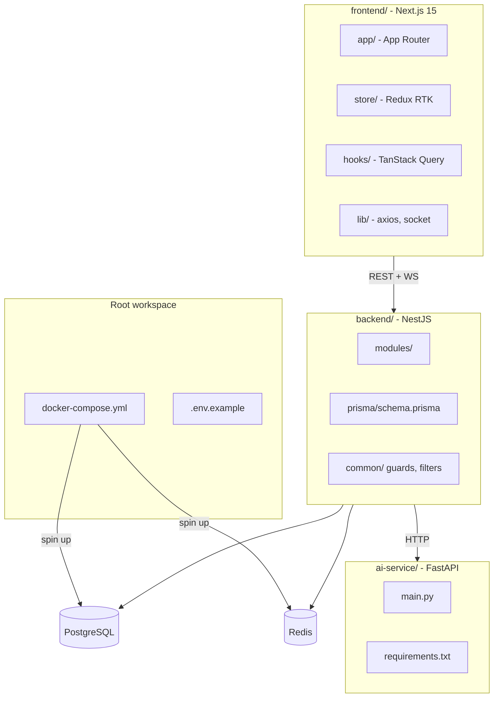

# Dựng Codebase Base - Stock Trading Platform

## Tổng quan kiến trúc



## Cấu trúc thư mục chi tiết

```
stock-trading-platform/
├── docker-compose.yml          # PostgreSQL + Redis
├── .env.example
├── backend/
│   ├── prisma/
│   │   └── schema.prisma       # Toàn bộ 13 entities
│   └── src/
│       ├── modules/
│       │   ├── auth/           # JWT, cookie, register/login
│       │   ├── users/          # Profile, đổi mật khẩu
│       │   ├── stocks/         # CRUD mã CK
│       │   ├── market/         # Bảng giá, PriceHistory, giả lập
│       │   ├── orders/         # LO/ATO/ATC, matching engine
│       │   ├── trades/         # Lịch sử khớp
│       │   ├── wallet/         # Số dư, CashTransaction
│       │   ├── watchlist/      # Watchlist + WatchlistItem
│       │   ├── notifications/  # Notification
│       │   ├── admin/          # CRUD, thống kê, SystemConfig
│       │   └── ai/             # Proxy gọi FastAPI
│       ├── common/
│       │   ├── guards/         # JwtAuthGuard, RolesGuard
│       │   ├── decorators/     # @CurrentUser, @Roles
│       │   ├── filters/        # GlobalExceptionFilter
│       │   └── interceptors/   # ResponseInterceptor
│       ├── prisma/             # PrismaService (singleton)
│       ├── redis/              # RedisService
│       └── websocket/          # AppGateway (Socket.IO)
├── frontend/
│   └── src/
│       ├── app/                # App Router pages (login, dashboard, market...)
│       ├── components/         # UI components dùng chung
│       ├── store/              # Redux RTK (UI state)
│       ├── hooks/              # Custom hooks TanStack Query
│       ├── lib/                # axios instance, socket.io client
│       └── types/              # TypeScript types/interfaces
└── ai-service/
    ├── main.py                 # FastAPI app, 2 endpoint placeholder
    └── requirements.txt
```

## Prisma Schema - 13 entities

Tất cả entities đã thiết kế: `User`, `Stock`, `Wallet`, `Position`, `Order`, `Trade`, `PriceHistory`, `AIAnalysis`, `CashTransaction`, `Watchlist`, `WatchlistItem`, `Notification`, `ExchangeCalendar`, `SystemConfig`.

## Thứ tự thực hiện

1. **Root level**: `docker-compose.yml` (postgres:16 + redis:7), `.env.example`
2. **Backend**: `nest new backend` → cài deps → cấu hình `prisma/schema.prisma` đầy đủ → tạo skeleton tất cả modules → setup `PrismaService`, `RedisService`, `AppGateway` placeholder
3. **Frontend**: `create-next-app` (App Router, TS, Tailwind) → cài deps → cấu hình `axios`, `redux store`, `TanStack Query provider`, `socket.io-client` → tạo layout base + trang placeholder
4. **AI-service**: tạo `main.py` FastAPI với 2 endpoint placeholder (`POST /analyze/{symbol}`, `GET /indicators/{symbol}`), `requirements.txt`

## Packages cài đặt

**Backend deps chính:**

- `@nestjs/jwt`, `@nestjs/passport`, `passport-jwt`, `bcrypt`
- `@prisma/client`, `prisma`
- `@nestjs/websockets`, `@nestjs/platform-socket.io`, `socket.io`
- `redis` (node-redis)
- `class-validator`, `class-transformer`
- `@nestjs/config`, `cookie-parser`

**Frontend deps chính:**

- `@tanstack/react-query`, `@reduxjs/toolkit`, `react-redux`
- `axios`, `socket.io-client`
- `highcharts`, `highcharts-react-official`
- `tailwindcss`, `@tailwindcss/forms`

**AI-service:**

- `fastapi`, `uvicorn`, `pandas`, `numpy`, `ta` (technical analysis)
